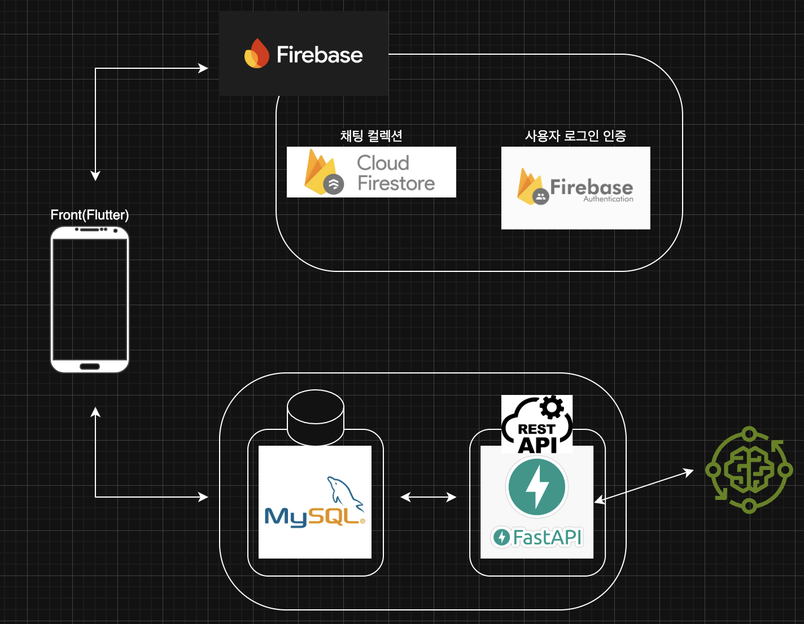
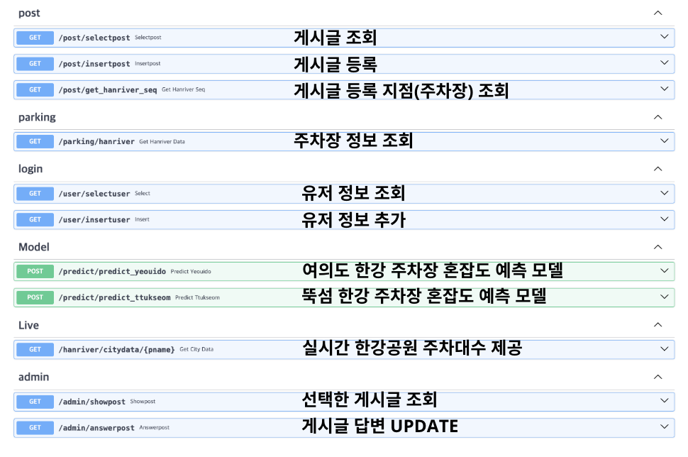
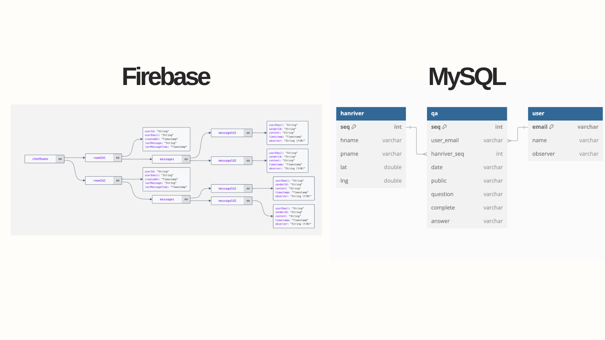

# 🚗 RiverPark Mate
> 실시간 주차 정보와 혼잡도 예측이 필요한 당신에게  
> 서울 한강공원의 주차장을 더 똑똑하게 사용하는 방법

한강공원을 방문할 때마다 주차장이 만차일까 걱정되셨다면,  
RiverPark Mate가 그 고민을 덜어드릴 거예요.  
이 앱은 **실시간 주차 가능 대수**와 **머신러닝 기반 시간대별 혼잡도 예측**을 통해  
더 효율적인 외출을 도와주는 어플리케이션입니다.

---

## 📽️ 데모 영상  
> 실제 앱 사용 흐름이 궁금하다면 아래 링크를 클릭해주세요!  
[👉 유튜브 시연 영상 보러가기](https://youtu.be/fRToL5UWEd4)

---

## 🧩 프로젝트 개요

RiverPark Mate는 서울시 공공데이터를 활용해  
한강공원(여의도/뚝섬)의 **실시간 주차 정보**와  
**시간대별 주차 혼잡도 예측**을 제공하는 모바일 앱입니다.

Firebase를 통한 로그인과 실시간 채팅,  
FastAPI를 통한 머신러닝 모델 연동 등  
프론트-백-ML이 연결된 서비스 전체 흐름을 직접 설계하고 구현했습니다.

---

## 👨‍💻 맡은 역할 (기여도 100%)

| 분야        | 주요 내용 |
|-------------|-----------|
| **프론트엔드** | - Figma 기반 UI/UX 설계 - Flutter 메인화면 전체 구현 - 지도 마커, 새로고침, 시간대별 인사말 등 기능 |
| **백엔드 연동** | - FastAPI 서버 구축 - Flutter와의 API 통신 구조 설계 및 JSON 포맷 처리 |
| **머신러닝** | - 서울시 교통량/유동인구 데이터 전처리 - 시간대별(XGBoost 기반) 주차 예측 모델 구현 - 예측 API 설계 및 실서비스 적용 |

---

### 🛠 기술 스택

- **Frontend** :  
  
  

- **Backend** :  
  
  

- **ML** :  
  
  

- **Database** :  
  
  

- **Design & Tools** :  
  
  
  
  
  

---

## 🌟 주요 기능

| 기능         | 설명 |
|--------------|------|
| ✅ 실시간 주차 정보 | 서울 열린데이터 API로 실시간 주차 가능 대수 수집 |
| 📊 혼잡도 예측 | FastAPI로 호출된 ML 모델이 아침/낮/저녁 시간대 혼잡도 예측 |
| 💬 실시간 채팅 | Firestore를 통한 주차장별 사용자 간 실시간 의견 공유 |
| 🔐 사용자 인증 | Firebase Auth 기반 로그인 / 회원가입 처리 |

---

## 🖥️ 시스템 아키텍처

Flutter → FastAPI → ML 모델 → 응답 반환  
+ Firebase를 통한 인증 및 실시간 채팅  

> 

---

## 📘 API 
FastAPI를 통해 서버와 통신하며 예측 모델을 호출합니다.
아래는 사용된 **예측 관련한 API 목록**입니다.

- 예측 모델은 주차장 위치(여의도/뚝섬)에 따라 분리되어 있으며,
- 각 모델은 별도의 라우터로 구성되어 정확도를 높였습니다.

## 🧬 ERD

### MySQL

- **user**: 사용자 정보  
- **hanriver**: 주차장 정보 (이름, 위도, 구획 수 등)  
- **qa**: 사용자 질문 / 피드백

### Firestore

- **chatRooms → roomId → messages → messageId**  
  메시지에 작성자, 내용, 타임스탬프 포함

---

## 🧠 트러블슈팅 기록

실제 API 연동 및 모델 서빙 과정에서  
다양한 문제를 경험했고, 직접 해결했습니다.

### 🔸 JSON 포맷 불일치 오류

- **문제**: Flutter에서 보낸 JSON과 모델 학습 시 feature 순서가 달라 예측 결과가 엉망
- **해결**: Pydantic 기반 요청 모델 사용 + pandas로 feature 순서 강제 정렬

---

### 🔸 예측 결과 디코딩 실패

- **문제**: FastAPI 응답에서 `np.float32` 타입이 Flutter에서 `null` 처리됨
- **해결**: Python float로 변환하여 `jsonable_encoder()`로 직렬화

---

### 🔸 모델 분기 처리 문제

- **문제**: 여의도와 뚝섬의 데이터 분포와 feature 구성이 달라 하나의 모델로 통합 불가
- **해결**: `/predict_yeouido`, `/predict_ttukseom` 등으로 라우터 분기 처리

---

### 🔸 누적형 공공데이터 처리

- **문제**: 서울시 API는 "누적 입차 차량 수"만 제공하여 시간대별 혼잡도 파악이 어려움
- **해결**: 교통량 및 유동인구 데이터와 병합하여 시간 단위로 재구성 + 평균값 기반 보정

---

## 📊 머신러닝 분석 요약

- 데이터: 서울시 교통량, 유동인구, 요일/시간 등  
- 상관계수 분석을 통해 Feature 선정  
- 모델 성능 평가:  
  - XGBoost가 높은 R2 Score와 낮은 MSE로 최종 선택됨  
  - 실제값과 예측값 간 분산이 작고, 대체로 y=x 선형 분포를 따름

---

## 💬 느낀 점

처음에는 단순히 “예측 결과를 보여주는 앱”이라고 생각했지만,  
데이터 전처리부터 모델링, API 설계, Flutter UI 구성까지  
직접 손으로 구현하면서 **개발이란 다양한 기술의 연결**임을 배웠습니다.

특히 FastAPI와 Flutter의 연동, JSON 처리, Firebase와의 통합은  
신입 개발자로서 실무 수준의 경험을 얻기에 충분한 도전이었습니다.

---

## 📌 GitHub Repo  
> 소스코드와 더 자세한 정보는 아래 링크에서 확인할 수 있어요  
[🔗 RiverPark Mate GitHub](https://github.com/donghun-ha/RiverPark-Mate)
